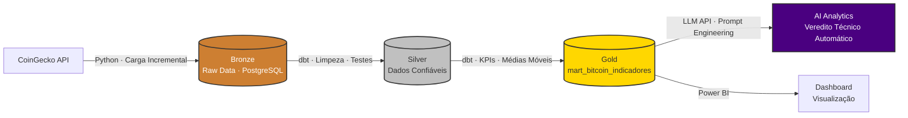

# Bitcoin Data Pipeline — End-to-End Engineering + AI Analytics


> "Dado bom é dado que gera decisão. IA boa é IA que gera decisão mais rápido."

Pipeline ELT completo com **Arquitetura Medallion** integrando ingestão via API, transformações em dbt Core, CI/CD automatizado via GitHub Actions e um módulo de **IA Generativa** que atua como estrategista sênior de cripto — analisando médias móveis, momentum e volatilidade para emitir veredito técnico automático sobre o Bitcoin.

---

## Resultado — Dashboard Power BI


| Indicador | Valor Atual |
|---|---|
| Último Preço (BTC/USD) | $82.670 |
| Variação Diária | -7,28% |
| Média Móvel 7d (MMS_7d) | Calculada diariamente via dbt |
| Média Móvel 30d (MMS_30d) | Calculada diariamente via dbt |

---

## Arquitetura — Medallion com IA na camada final

Pipeline estruturado em quatro camadas. As três primeiras seguem a Arquitetura Medallion padrão. A quarta adiciona inteligência analítica automatizada via LLM.



**Bronze — Ingestão Incremental**
Coleta de dados históricos do Bitcoin via API CoinGecko com estratégia de Stateful Loading: o script verifica a última data no banco (`max_date`) e busca apenas os registros novos (D-1), evitando duplicidade e consumo desnecessário da API. Armazenamento em PostgreSQL hospedado no Supabase via Pooler (porta 6543).

**Silver — Camada Confiável**
Transformações em dbt Core: limpeza, tipagem forte (casting), deduplicação e tratamento de nulos. Testes automatizados de schema garantem unicidade e integridade referencial antes de qualquer dado chegar à camada analítica.

**Gold — Camada Analítica**
Tabela `mart_bitcoin_indicadores` com KPIs calculados via dbt: Médias Móveis de 7 e 30 dias (MMS_7d e MMS_30d), volatilidade histórica e variação percentual diária. Otimizada para consumo simultâneo pelo Power BI e pelo módulo de IA.

**AI Analytics — Inteligência Generativa**
O módulo de IA lê os indicadores calculados na camada Gold e atua como estrategista sênior de cripto. A LLM analisa cruzamento de médias móveis, momentum e regime de volatilidade para gerar um veredito textual estruturado (Compra / Venda / Neutro) com justificativa técnica completa — entregue automaticamente a cada execução do pipeline.

---

## CI/CD — Pipeline Automatizado

Workflow completo no GitHub Actions com execução diária e gatilho manual:

```yaml
Trigger: Schedule 09:00 UTC + workflow_dispatch

Steps:
  1. Provisionamento Ubuntu Latest
  2. Instalação de dependências (requirements.txt)
  3. Injeção de credenciais via GitHub Secrets
  4. Ingestão: Python → CoinGecko API → Bronze (PostgreSQL)
  5. Transformação: dbt run + dbt test → Silver → Gold
  6. Inteligência: LLM API → leitura da Gold → relatório automático
```

Credenciais gerenciadas exclusivamente via GitHub Secrets — nenhuma chave de API exposta no código.

---

## Decisões de Engenharia

**Carga Incremental (Stateful Loading)**
O script de ingestão verifica o `max_date` antes de cada execução. Isso elimina reprocessamento desnecessário, reduz consumo da API e mantém o pipeline eficiente mesmo com meses de histórico acumulado.

**dbt como camada de transformação central**
Toda a lógica de negócio — limpeza, deduplicação, cálculo de médias móveis e métricas de volatilidade — vive em SQL versionado no dbt, com testes automatizados e documentação de linhagem. Nenhuma transformação acontece fora do dbt.

**LLM sobre a camada Gold**
A IA não acessa dados brutos. Ela consome exclusivamente a camada Gold já validada e testada, garantindo que o veredito técnico seja baseado em dados confiáveis — não em ruído da Bronze.

---

## Stack

Python · dbt Core · PostgreSQL · Supabase · CoinGecko API · GitHub Actions · LLM APIs · Power BI · SQL Avançado · Star Schema · Arquitetura Medallion · Prompt Engineering · CI/CD

---

## Sobre o Projeto

Projeto desenvolvido como parte do portfólio de Analytics Engineering com foco em Modern Data Stack e IA aplicada a dados financeiros. A mesma arquitetura base deste pipeline está em operação em ambiente de produção na Faculdade IBRA, cobrindo dezenas de milhares de registros financeiros com entrega de relatórios executivos mensais gerados por IA diretamente para a diretoria.

Portfólio completo: [github.com/jorgesousaneves](https://github.com/jorgesousaneves)
